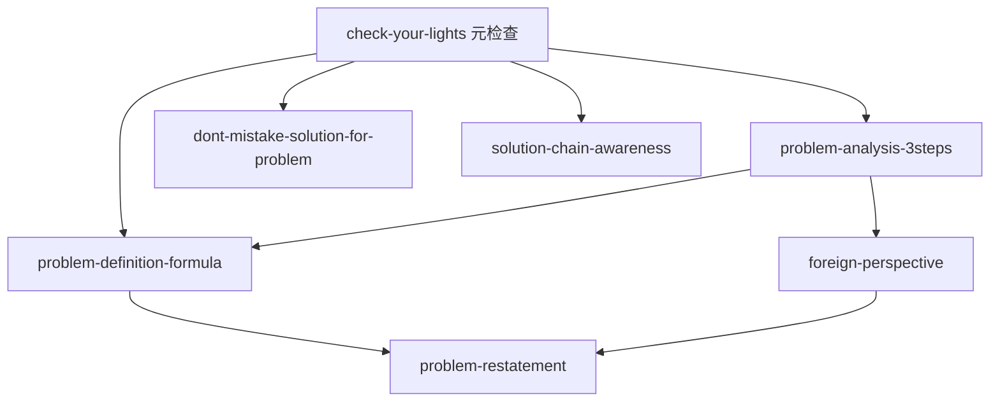

# INDEX — 《你的灯亮着吗》技能图谱

## 技能总览

| # | skill | 类型 | 调用时机 |
|---|-------|------|----------|
| 1 | `problem-definition-formula` | 核心框架 | 感到模糊、说不清问题时 |
| 2 | `problem-analysis-3steps` | 分析框架 | 需要多角色分析时 |
| 3 | `problem-restatement` | 创意方法 | 解决方案卡壳时 |
| 4 | `solution-chain-awareness` | 风险意识 | 方案上线前后 |
| 5 | `dont-mistake-solution-for-problem` | 思维陷阱检查 | 发现"问题描述"像方案时 |
| 6 | `foreign-perspective` | 视角转换 | 对熟悉事物需要新视角时 |
| 7 | `check-your-lights` | 元检查 | 开始任何问题解决前 |

## 引用关系

## 推荐学习路径

1. 先读 `check-your-lights`（建立元认知）
2. 然后读 `problem-definition-formula`（核心操作）
3. 接着读 `problem-analysis-3steps`（多角色分析）
4. 然后读 `dont-mistake-solution-for-problem`（防陷阱）
5. 进阶读 `problem-restatement` + `foreign-perspective`（创意突破）
6. 最后读 `solution-chain-awareness`（执行后反思）
